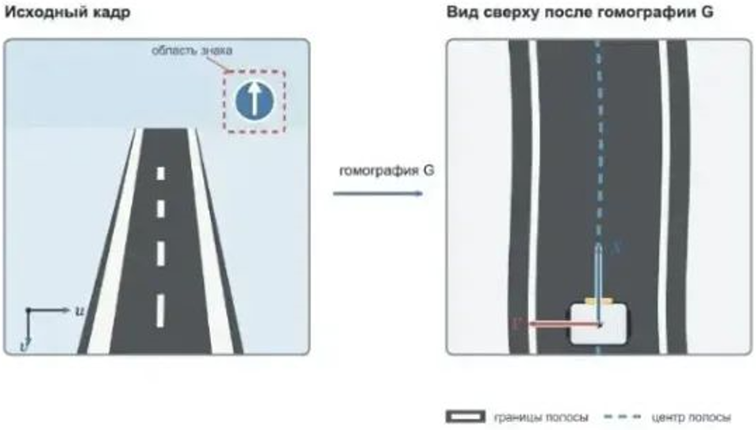
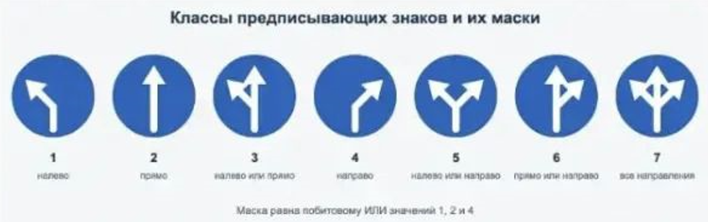

# Определение положения в полосе и распознавание дорожных знаков.

- Ограничение времени: 30 секунд.
- Ограничение памяти: 512 Мб.
- Ввод: стандартный ввод или input.txt.
- Вывод: стандартный вывод или output.txt.

**Темы**: компьютерное зрение, OpenCV, преобразование перспективы, цветовая сегментация, морфологические операции, дорожная разметка, распознавание знаков.

**Ограничение**: TL — 30 с, ML — 512 МБ.

**Решение запускается в окружении**: `CPython 3.12.3`, `NumPy 2.1.0` и `OpenCV contrib headless 4.10.0.84`.

При отправке решения используется компилятор `(make) Python 3.12.3`.

Фронтальная камера мобильного робота наблюдает участок дороги перед роботом. На кадре видны границы полосы и один предписывающий дорожный знак. Результат обработки кадра используется двумя подсистемами:
- регулятор движения получает боковое отклонение и ошибку направления полосы;
- планировщик маршрута получает множество разрешённых направлений на ближайшем перекрёстке.

Изображение передаётся как `PNG` в кодировке `Base64` **и декодируется так же, как в задаче 2**. После `cv2.imdecode` изображение имеет тип `uint8` и порядок каналов `BGR`.

### Вид сверху

Входные данные содержат матрицу гомографии $G$ размера $3 \times 3$, переводящую исходный кадр в изображение дороги с высоты птичьего полёта:

```
bev = cv2.warpPerspective(image, G, (W_b, H_b))
```

В изображении вида сверху:
- Начало системы координат робота находится в пикселе $(W_{b}/2,H_{b}-1)$.
- Ось $X$ направлена вперёд и соответствует уменьшению координаты строки.
- Ось $Y$ направлена влево и соответствует уменьшению координаты столбца.
- Масштаб равен $S$ пикселям на метр по обеим осям.

Таким образом, для пикселя $(u,v)$ координаты на плоскости равны:
$$
X = \frac{H_{b}-1-v}{S}, Y = \frac{W_{b}/2-u}{S}.
$$



### Центральная линия полосы

В рабочем диапазоне $0<=X<=X_{max}$ центральная линия полосы может быть описана квадратичной функцией
$$
Y(X) = aX^2+bX+c.
$$

Необходимо оценить три параметра движения:
$$
e_{y}=c,\\
e_{\theta}=arctan(b),\\
k=\frac{2a}{(1+b^2)^{3/2}}
$$

Здесь $e_{y}$ — положение центра полосы относительно робота, $e_{\theta}$ — ошибка направления в начале зоны обзора, а $k$ — кривизна центральной линии.

Ширина полосы $D$ известна. В системе координат вида сверху обе границы полосы задаются функциями:
$$
Y_{left}(X)=Y(X)+\frac{D}{2},\\Y_{right}(X)=Y(X)-\frac{D}{2}
$$

Обе границы присутствуют в рабочем диапазоне, но разметка может быть пунктирной и иметь локальные разрывы. Центральную линию можно восстанавливать как полусумму координат границ при одинаковом $X$. На изображении также могут находиться небольшие светлые объекты, не относящиеся к дороге.

Участник самостоятельно выбирает способ обработки. Предполагаемое решение может использовать перевод в `HSV.cv2.inRange`, морфологические операции, `cv2.findContours`, `cv2.connectedComponentsWithStats` и аппроксимацию точек.

### Предписывающий знак

Прямоугольная область знака задаётся во входных данных в координатах исходного кадра. В этой области находится не более одного знака. Вместе со сценой во входе даны эталонные изображения всех возможных классов знаков.

Каждому направлению соответствует бит:

| Направление | Бит | Значение |
|-|-|-|
| Налево | 0 | 1 |
| Прямо | 1 | 2 |
| Направо | 2 | 4 |

Комбинации направлений кодируются побитовым ИЛИ. Например, знак «прямо или направо» имеет маску $2|4 = 6$. Если знак отсутствует, маска равна $0$.



Эта иллюстрация нужна для понимания классов и кодирования. Для распознавания рекомендуется брать эталонные `PNG` непосредственно из стандартного входа конкретного теста. Именно они имеют нужный размер и являются источником истины для сравнения, тогда как иллюстрация в условии может отображаться с другим масштабом или дополнительным сжатием.

Эталонные изображения имеют тот же размер, что и область знака, и передаются как `PNG/Base64`. Допускается использовать сопоставление шаблонов, сравнение контуров, `Hu‑моменты` или иной алгоритм `OpenCV`.

## Задание

По исходному кадру определите боковое отклонение $e_{y}$, ошибку направления $e_{\theta}$, кривизну $\kappa$ и маску разрешённых направлений $mask$.

### Формат ввода

- В первой строке заданы четыре целых числа $H, W, H_{b}, W_{b}$ — размеры исходного изображения и изображения вида сверху: $128 \le H, W \le 1920, 64 \le H_{b}, W_{b} \le 1024$. Число $W_{b}$ чётно.
- Во второй строке задан исходный `PNG-кадр` в кодировке `Base64`.
- В следующих трёх строках задано по три вещественных числа — Матрица гомографии $G$. Она обратима, нормирована условием $G_{2.2}=1$, а модуль каждого её элемента не превосходит $10^6$.
- В следующей строке задано три вещественных числа $S, D, X_{max}$ — масштаб в пикселях на метр, ширина полосы и дальность рабочей области: $10 \le S \le 1000, 0.1 \le D \le 2, 0.2 \le X_{max} \le 10$, причём $X_{max} \le (H_{b}-1)/S$ и $SX_{max} \ge 50$.
- В следующей строке заданы четыре целых числа $u_1, v_1, u_2, v_2$ — границы области знака в исходном кадре. Используется полуинтервал `image[v1:v2, u1:u2]`. Гарантируется, что область находится внутри кадра.
- В следующей строке заданы три целых числа $K, H_{S}, W_{S}$ — количество эталонов и размер каждого эталона. Выполняется $1 \le K \le 7, 32 \le H_{S}, W_{S} \le 256$, причём размер области знака равен $H_{S} \times W_{S}$.
- В следующих $2K$ строках описаны эталоны. Сначала в отдельной строке задана маска класса $m_{i}, 1 \le m_{i} \le 7$, затем в следующей строке — `PNG-изображение` эталона в кодировке `Base64`. Все маски различны.

Длина каждой строки `Base64` не превышает $8 \cdot 10^6$ символовОбщий размер входного файла не превышает 32 МБ.

**На изображениях соблюдаются следующие гарантии**:

- Изображения синтетические. До перспективного преобразования фон дороги в изображении вида сверху имеет цвет BGR (48, 50, 52), а разметка — (248, 248, 248).
- Толщина каждой границы равна $max(2, round(0.045S))$ пикселям. Каждая граница содержит пиксель с яркостью не менее $150$ не менее чем в $40\%$ строк восстановленного изображения вида сверху в диапазоне $0 \le X \le X_{max}$.
- Не менее чем в $30\%$ строк этого диапазона одновременно присутствуют пикселы обеих границ с яркостью не менее $165$.
- Небольшие светлые помехи имеют яркость от $185$ до $241$, не касаются границ полосы и ни самостоятельно, ни вместе с одной из границ не образуют дополнительную пару светлых объектов ширины $D$.
- Перед добавлением знака яркость исходного кадра может быть умножена на коэффициент от $0.88$ до $1.0$. Затем может применяться гауссово размытие с ядром не более $5 \times 5$.
- Фактическая центральная линия удовлетворяет заданной квадратичной модели.
- Модуль бокового отклонения не превосходит $D$.
- $|e_{\theta}| \le 0.5 \ рад$ и $|k| \le 2 \ м^{-1}$
- Знак, если он присутствует, относится к одному из переданных классов. По сравнению с соответствующим эталоном его яркость может быть умножена на коэффициент от $0.96$ до $1.02$, затем может применяться размытие $3 \times 3$ и сдвиг не более чем на один пиксель по каждой оси.
- Для присутствующего знака средняя абсолютная ошибка по всем значениям `BGR` относительно правильного эталона не превосходит $12$ и как минимум на $3$ меньше ошибки до любого другого эталона. Если знака нет, ошибка до каждого эталона строго больше $35$.

### Формат вывода

Выведите в одной строке три вещественных числа и одно целое число:
$$e_{y} \ e_{\theta} \ \kappa \ mask$$

Рекомендуется выводить не менее шести знаков после десятичной точки.

Ответ считается корректным, если:
- абсолютная ошибка $e_{y}$ не превышает $0.03 \ м$;
- абсолютная ошибка $e_{\theta}$ не превышает $0.03 \ рад$;
- абсолютная ошибка $\kappa$ не превышает $0.08 \ м^{-1}$;
- маска знака определена точно.

### Система оценивания

| Группа |	Баллы	| Дополнительные ограничения |
| - | - | - |
| 1 |	4 |	Вид сверху уже совпадает с исходным кадром. Обе границы сплошные. Знак отсутствует. |
| 2 |	4 |	Требуется преобразование перспективы. Обе границы могут быть пунктирными и иметь локальные разрывы. Знак отсутствует. |
| 3 |	3 |	Полоса прямая и полностью видна. Требуется только распознавание знака в фиксированной области. |
| 4 |	4 |	Ограничения исходной задачи. Одновременно присутствуют перспектива, неполная разметка, знак и помехи. |

Баллы за группы начисляются независимо.

## Пример

